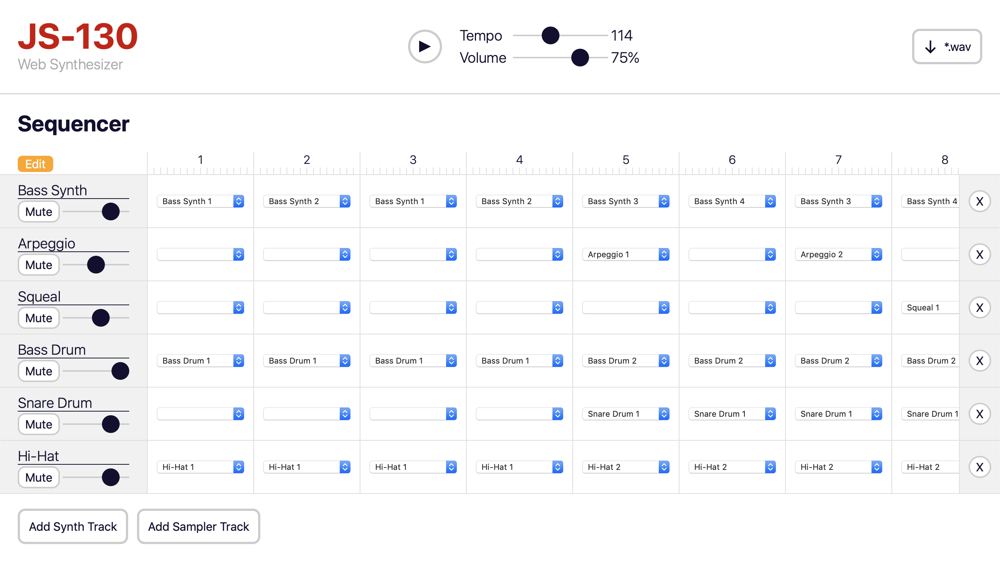
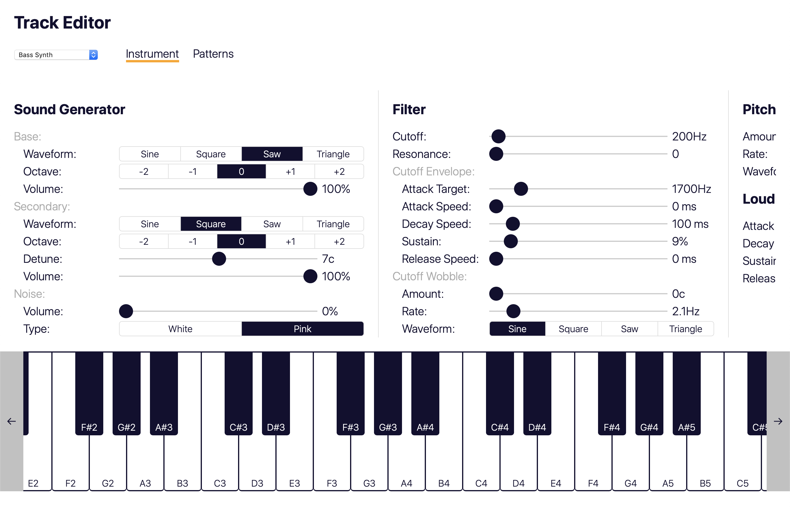

# JS-130

A synthesizer and sequencer that runs in your browser, using the WebAudio API.

Try it out here: [https://www.joelstrait.com/jssynth/](https://www.joelstrait.com/jssynth/)

## Example Song

The song below is an example of what you can create with the JS-130, along with [Beats Drum Machine](https://beatsdrummachine.com) and GarageBand.

[JS-130 Example Song](https://www.joelstrait.com/jssynth/js-130-demo.m4a)

## Features

* Oscillator Instruments
  * Base oscillator with sine/square/saw/triangle wave
  * Secondary oscillator with same wave types, and optional detune from primary oscillator
  * White or pink noise
  * Adjustable volume for each noise source (oscillator 1, oscillator 2, noise)
  * LFO to control oscillator pitch (i.e. "pitch wobble")
  * Filter, with LFO and ADSR envelope to control filter cutoff frequency
  * ADSR Envelope to control loudness
  * Feedback delay and reverb effects
* Sampler Instruments
  * Use a sound file (*.wav, *.mp3, etc.) as an instrument
  * Filter, with LFO and ADSR envelope to control filter cutoff frequency
  * ADSR Envelope to control loudness
  * Feedback delay and reverb effects
* Sequencer
  * Multiple tracks, each with its own instrument and set of patterns
  * Enter notes in patterns via on-screen piano keyboard, MIDI keyboard, or computer's keyboard
  * Full songs 1-99 patterns long
  * Volume control + mute for each track
* Tempo control
* Master volume control
* On-screen keyboard to enter notes and try out sounds
* MIDI keyboard support (only in browsers that support Web MIDI, such as Chrome)
* Download sequencer output to a *.wav file

## Screenshots

Sequencer:

---

Instrument editor:

---

Pattern editor:

